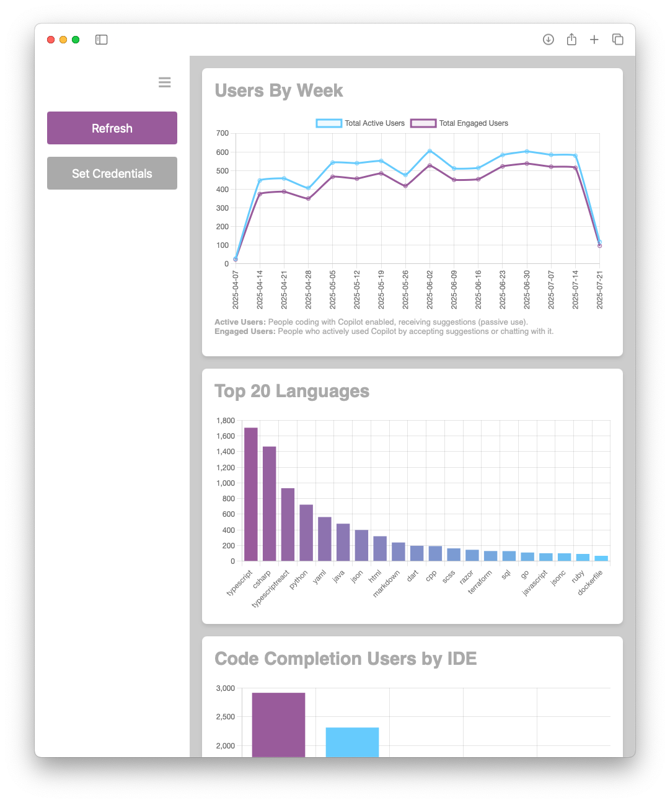

# GitHub Copilot Dashboard

A simple web page that shows how Zühlke employees use GitHub Copilot:

## What It Does
- Fetches data from GitHub API.
- Displays different metrics as charts.

## How to Use
* Open `webpage/index.html` in your browser.
* When no credentials have been set: Click "Set Credentials" and enter your GitHub organization name and API key.
* When credentials have already been set: Click "Refresh".

Note: This is a client-side tool; keep your API key secure.